# PAS User Guide

PAS (Pascal's Discrete Attractor) is a pipeline runner for AI workflows. You define pipelines as DOT (Graphviz) digraphs. Provider-backed nodes run in their explicitly selected local Claude Code, Codex, or Gemini CLI; other nodes may route, execute tools, or wait for input without starting an LLM. The engine handles traversal, branching, retries, quality gates, and cost tracking.

## Table of Contents

- [Quick Start](#quick-start)
- [DOT File Anatomy](#dot-file-anatomy)
- [Nodes](#nodes)
- [Edges](#edges)
- [Conditional Routing](#conditional-routing)
- [Goal Gates](#goal-gates)
- [Stylesheets](#stylesheets)
- [Variable Expansion](#variable-expansion)
- [Validation Rules](#validation-rules)
- [Edge Selection Algorithm](#edge-selection-algorithm)
- [Pipeline Patterns](#pipeline-patterns)
- [Planning Workflow](#planning-workflow)
- [Integrating with Beads](#integrating-with-beads)
- [Adding to Your Project](#adding-to-your-project)
- [Writing Effective Prompts](#writing-effective-prompts)
- [Multi-Provider Support](#multi-provider-support)
- [Cost Control](#cost-control)
- [Troubleshooting](#troubleshooting)

---

## CLI Reference

For full CLI documentation with all flags, examples, and environment setup, see **[cli-reference.md](cli-reference.md)**.

---

## Quick Start

### Build

```bash
cd /path/to/connect-the-bots
./install.sh
```

This builds a release binary and installs it to `~/.local/bin/pas`.

### Create a pipeline

Create `hello.dot`:

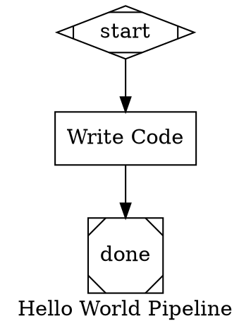

### Run it

```bash
pas run hello.dot -w /path/to/your/project
```

### Other commands

```bash
pas validate hello.dot   # Check for errors without running
pas info hello.dot       # Show structure (nodes, edges, goal)
pas plan --prd           # Generate a PRD template
pas plan --spec          # Generate a spec template
pas generate spec.md     # Generate pipeline .dot from spec
pas decompose spec.md   # Decompose spec into beads tasks
pas scaffold <EPIC_ID>   # Scaffold pipeline from beads epic
```

---

## DOT File Anatomy

Every pipeline is a `digraph` with graph-level attributes, node definitions, and edges.

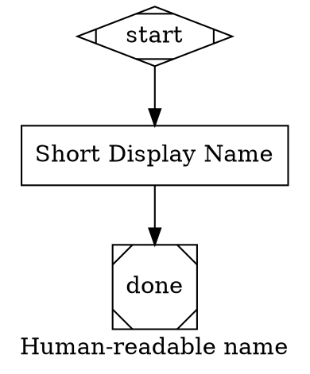

### Graph attributes

| Attribute | Purpose |
|-----------|---------|
| `label` | Pipeline display name |
| `goal` | Objective description — injected into every node's context |
| `model` | Default LLM model for all nodes (e.g. `"sonnet"`, `"haiku"`, `"opus"`) |
| `retry_target` | Global fallback retry target for goal gates |
| `fallback_retry_target` | Second-level global fallback |
| `model_stylesheet` | Inline CSS-like rules (compatibility alias: `stylesheet`; see [Stylesheets](#stylesheets)) |

---

## Nodes

### Node shapes

| Shape | Role | Handler |
|-------|------|---------|
| `Mdiamond` | **Start node.** Entry point. Exactly one required. | StartHandler (instant) |
| `Msquare` | **Exit node.** Pipeline completion. Exactly one required. | ExitHandler (instant) |
| `box` | **Task node.** Runs the selected provider CLI with the `prompt`. | CodergenHandler |
| `diamond` | **Conditional node.** With a prompt or explicit `type="codergen"` it uses CodergenHandler; otherwise it is pass-through routing. | ConditionalHandler or CodergenHandler |
| `hexagon` | **Human gate.** Pauses for human input/approval. | WaitHumanHandler |
| `parallelogram` | **Tool node.** Runs a shell command. | ToolHandler |
| `component` | **Sequential compatibility node.** May have at most one outgoing edge. | ParallelHandler |
| `tripleoctagon` | **Recognized fan-in syntax.** Rejected during semantic compilation. | Not executable |

### Parallel and fan-in compatibility

PAS executes one successor per step; it does not implement fork/join execution or branch-result merging. A `component` node (or `type="parallel"`) therefore compiles only with zero or one outgoing edge, where it acts as sequential pass-through compatibility. A component with multiple outgoing edges fails with `unsupported_execution_topology`, including multiple authored edges that target the same node.

Every `tripleoctagon`, `type="fan_in"`, or `type="parallel.fan_in"` node fails with the same blocking diagnostic, regardless of its incoming or outgoing edge count. Linearize the workflow until branch execution and deterministic merging are supported end to end.

### Node attributes

| Attribute | Type | Default | Description |
|-----------|------|---------|-------------|
| `label` | string | node ID | Display name shown in logs |
| `prompt` | string | — | Task sent to the selected provider CLI. |
| `type` | string | auto | Explicit handler type override (`node_type` and `handler` are compatibility aliases); recognized parallel/fan-in types remain subject to the execution-topology restrictions above |
| `llm_model` | string | graph `model` | Model override for this node (`"haiku"`, `"sonnet"`, `"opus"`, or full model ID) |
| `llm_provider` | string | — | Required whenever the resolved handler consumes a provider: `"claude"`, `"codex"`, or `"gemini"` |
| `allowed_tools` | string | all | Comma-separated Claude Code tool list (`"Read,Grep,Glob"` for read-only); rejected outside Claude-backed codergen nodes |
| `max_budget_usd` | string | unlimited | Maximum spend for this node's Claude Code session; rejected outside Claude-backed codergen nodes |
| `goal_gate` | boolean | false | If true, this node must succeed for the pipeline to complete |
| `retry_target` | string | — | Node ID to loop back to if this goal gate fails |
| `fallback_retry_target` | string | — | Second-level retry target |
| `max_retries` | integer | 0 | Additional retryable handler attempts per node visit; `N` allows at most `N + 1` total attempts |
| `timeout` | duration | — | Deadline enforced around every handler attempt (e.g. `"5m"`, `"1h30m"`) |
| `class` | string | — | Space-separated class list for stylesheet matching (`classes` is a compatibility alias) |
| `tool_command` | string | — | Shell command for `parallelogram` (tool) nodes |

### Claude settings isolation for codergen

Claude-backed `codergen` nodes use a PAS-owned isolation mode by default. PAS invokes Claude Code with `--safe-mode`, `--strict-mcp-config`, and `--disable-slash-commands` so normal Claude subscription auth still works while personal hooks, skills, plugins, MCP servers, and ambient Claude Code settings are suppressed as much as Claude allows without literal bare mode.

The default mode is `subscription_bare`. Two opt-ins exist:

- `strict_bare` uses Claude's literal `--bare` for maximum reproducibility, but requires API-key/auth-helper auth rather than normal subscription OAuth/keychain auth.
- `inherit` loads explicit Claude `setting_sources` and may run personal hooks/settings. Use it only when you want that leakage.

Configure the default for a repo in `pas.toml`:

```toml
[codergen.claude]
settings_mode = "subscription_bare" # subscription_bare | strict_bare | inherit
setting_sources = ["user"]           # only for inherit
settings_json = "{\"enabledPlugins\":{}}"
tools = "Read,Edit"
agents_json = "{}"
plugin_dirs = [".pas/claude-plugin"]
mcp_config_json = "{}"
```

Or override per run:

```bash
pas run pipeline.dot -w . --codergen-claude-settings-mode inherit --codergen-claude-setting-sources user
```

CLI flags override `pas.toml`. `--settings`-style PAS-owned config does not imply inheritance; user-scope Claude Code config is only loaded in `inherit` mode.

### Tool nodes (parallelogram)

Tool nodes run a shell command instead of a provider CLI:

```dot
run_tests [
    shape="parallelogram"
    label="Run Tests"
    tool_command="cd mlb_fantasy_jobs && uv run pytest tests/ -x -v"
]
```

The `tool_command` attribute is required for parallelogram nodes.

---

## Edges

Edges define the flow between nodes. Basic syntax:

```dot
nodeA -> nodeB                           // Unconditional
nodeA -> nodeB [label="Success"]         // Labeled
nodeA -> nodeB [condition="outcome=success"]  // Conditional
nodeA -> nodeB [weight=10]               // Weighted (higher = preferred)
```

### Edge attributes

| Attribute | Type | Default | Description |
|-----------|------|---------|-------------|
| `label` | string | — | Display label (also used for preferred_label matching) |
| `condition` | string | — | Condition expression that must be true for this edge |
| `weight` | integer | 0 | Higher weight = preferred when multiple edges match |
| `loop_restart` | boolean | false | If true, clears completed nodes and outcomes (for loops) |
| `reset_quality_loop_state` | boolean | false | If true, clears quality retry counters and failure footprints (for outer work-cycle transitions) |

### Chained edges

DOT supports edge chains:

```dot
start -> investigate -> implement -> test -> done
```

This creates edges: `start→investigate`, `investigate→implement`, `implement→test`, `test→done`.

---

## Conditional Routing

Prompted conditional nodes let the selected provider's response determine which
path the pipeline takes. A conditional without a prompt is pass-through routing
unless it explicitly sets `type="codergen"`; that exception remains provider-backed
and requires `llm_provider`.

### Setup

1. Make the node a `diamond` shape (or set `node_type="conditional"`)
2. Add outgoing edges with `label` and `condition` attributes
3. Write the prompt so the selected provider outputs one of the labels

```dot
review [
    shape="diamond"
    llm_provider="claude"
    label="Review Changes"
    prompt="Review the code changes. Check for bugs, style issues, and test coverage.
If everything looks good, respond with PASS on the last line.
If there are problems, respond with FAIL on the last line."
]

review -> deploy  [label="PASS", condition="preferred_label=PASS"]
review -> fixup   [label="FAIL", condition="preferred_label=FAIL"]
```

### How it works

1. The selected provider CLI runs the prompt
2. The handler scans the selected provider's response for one of the edge labels
3. It checks the last 5 lines for an exact match (case-insensitive)
4. Falls back to scanning the full response
5. Sets `preferred_label` on the outcome
6. The edge selection engine matches `condition="preferred_label=PASS"` and routes accordingly

### Condition syntax

Conditions use a simple expression language:

```
key=value                    // Equality
key!=value                   // Inequality
key=value && key2=value2     // AND (multiple clauses)
outcome=success              // Check the node's outcome status
preferred_label=BUY          // Check the extracted label
```

Available context keys in conditions:
- `outcome` — the node's status: `success`, `fail`, `partial_success`, `retry`, `skipped`
- `preferred_label` — the label extracted from the selected provider's response

---

## Goal Gates

Goal gates enforce quality requirements before the pipeline can exit. If a goal gate node fails, the pipeline either retries or errors out.

### Basic usage

```dot
final_review [
    shape="box"
    llm_provider="claude"
    label="Final Review"
    prompt="Verify all acceptance criteria are met."
    goal_gate=true
    retry_target="implement"
]
```

If `final_review` fails:
1. The pipeline loops back to `implement` and re-executes from there
2. On the second pass, if `final_review` succeeds, the pipeline exits normally

### Retry target resolution (4-level fallback)

When a goal gate fails, the retry target is resolved in this order:

1. **Node `retry_target`** — the node's own attribute
2. **Node `fallback_retry_target`** — the node's fallback
3. **Graph `retry_target`** — the graph-level default
4. **Graph `fallback_retry_target`** — the graph-level fallback

If no retry target is found at any level, the pipeline returns a `GoalGateUnsatisfied` error.
Retry targets must resolve to non-terminal nodes; targeting an exit node is a validation error because it cannot change the failed gate's outcome.

### Multiple goal gates

You can have multiple goal gate nodes. All are checked when the pipeline reaches the exit node. If any fail, the first failed gate's retry target is used.

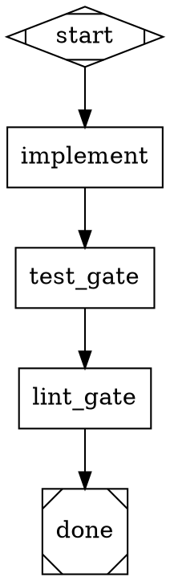

---

## Stylesheets

CSS-like rules for applying attributes to nodes by selector. Useful for setting models across groups of nodes without repeating yourself.

### Syntax

Stylesheets can be set as a graph attribute or applied programmatically:

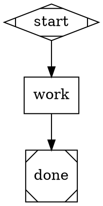

### Selectors

| Selector | Specificity | Matches |
|----------|-------------|---------|
| `*` | 0 | Every node |
| `.classname` | 1 | Nodes with `class="classname"` |
| `#node_id` | 2 | Node with matching ID |

Higher specificity wins. Explicit node attributes always override stylesheet values.

### Supported properties

| Property | Maps to |
|----------|---------|
| `llm_model` | `llm_model` node attribute |
| `llm_provider` | `llm_provider` node attribute |

### Example with classes

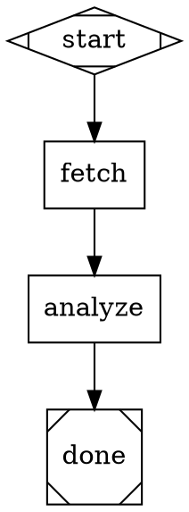

Here `fetch` uses haiku (from `*`), `analyze` uses sonnet (from `.analysis`).

---

## Variable Expansion

Node prompts can reference graph attributes using `${key}` syntax. Variables are expanded before semantic compilation.

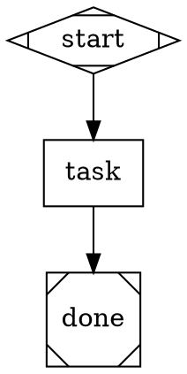

String, number, and boolean graph attributes are available as `${attribute_name}`.

---

## Validation Rules

Run `pas validate pipeline.dot` to compile canonical semantics and run structural lint rules:

| Rule | Severity | What it checks |
|------|----------|----------------|
| Semantic compilation | Error | Exactly one start/exit; known compatible roles, handlers, and providers; provider present for every `codergen` node |
| ReachabilityRule | Error | All nodes are reachable from start |
| EdgeTargetExistsRule | Error | All edge targets reference existing nodes |
| StartNoIncomingRule | Error | Start node has no incoming edges |
| ExitNoOutgoingRule | Error | Exit node has no outgoing edges |
| ConditionSyntaxRule | Error | All condition expressions parse correctly |
| RetryTargetNotTerminalRule | Error | Retry targets do not resolve to exit nodes |
| RetryTargetExistsRule | Warning | Retry targets reference existing nodes |
| GoalGateHasRetryRule | Warning | Goal gate nodes have a retry target defined |
| PromptOnLlmNodesRule | Warning | Resolved `codergen` nodes have a prompt or descriptive label |

Errors prevent execution. Warnings are reported but don't block.

---

## Edge Selection Algorithm

When a node completes, the engine selects the next edge using a 5-step priority cascade:

1. **Condition match** — Edges with a `condition` that evaluates to true. If multiple match, highest weight wins, then lexical order. A conditional edge is only ever taken this way.
2. **Preferred label** — An *unconditional* edge whose `label` matches the outcome's `preferred_label` (case-insensitive, strips `&` accelerators).
3. **Suggested next ID** — An *unconditional* edge whose target matches one of the outcome's `suggested_next_ids`.
4. **Highest weight** — The unconditional edge with the highest `weight` value.
5. **Lexical tiebreak** — Among those, the first by alphabetical target node ID.

To route on an LLM-extracted label, write the label into the condition: `condition="preferred_label=PASS"` (as in the examples below). A label on a conditional edge whose condition is false is never followed, so an agent that failed but ended its text with `PASS` does not take `[label="PASS", condition="outcome=success"]`.

If the node has outgoing edges and none applies, the run stops with `node '<id>' outcome <status> matched no outgoing edge (conditions: ...)`, whatever the status; there is no fallback to the first edge (this differs on purpose from the upstream spec, which ends the run normally for a non-fail outcome). If the node has no outgoing edges, a `Fail` errors and any other status ends the run normally. A resume after the error reports "Max retries exhausted" for the node; use `--fresh` to start over.

---

## Pipeline Patterns

### Linear pipeline

The simplest pattern — sequential steps:

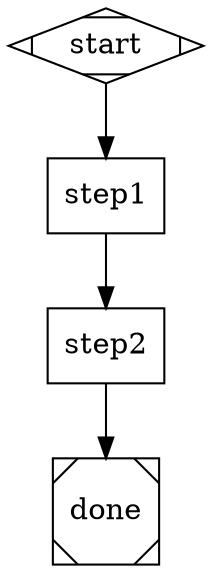

### Verify/fixup loop

The most common pattern for real work. A conditional node checks quality and loops back on failure:

```
start → work → verify ──PASS──→ done
                  └──FAIL──→ fixup ─→ verify
```

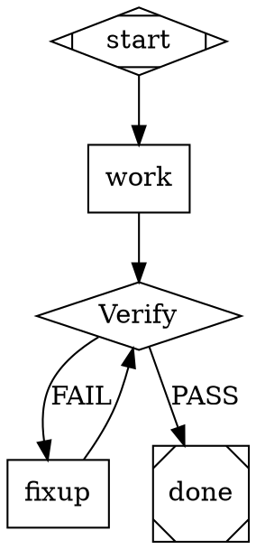

### Branching pipeline

Route to different paths based on analysis:

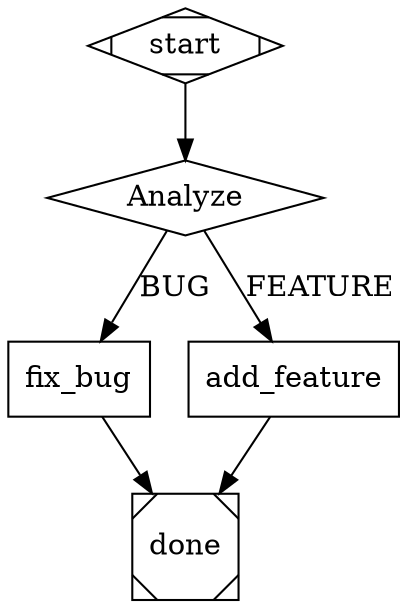

### Goal gate with retry

Enforce that critical nodes succeed before the pipeline completes:

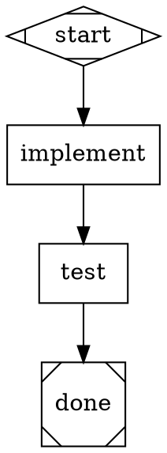

If `test` fails, the pipeline loops back to `implement` and tries again. On the second pass, the pipeline reaches `done` and checks all goal gates — if `test` succeeded this time, it exits.

### Feature implementation (full pattern)

The recommended pattern for implementing features or fixing bugs:

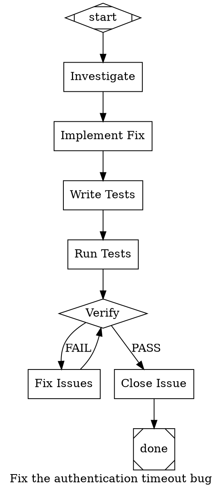

---

## Planning Workflow

PAS includes a full planning-to-execution workflow that bridges structured documents to beads issue tracking to pipeline execution.

### The flow

```
write PRD → review → write spec → review → decompose → scaffold → validate → execute
```

The **PRD** captures *what and why* (goals, user stories, requirements). The **spec** captures *how* (architecture, file changes, implementation phases). The spec's phases become beads issues, which become a PAS pipeline.

### Step 1: Generate documents

```bash
# Generate a PRD from a one-line description
pas plan --prd --from-prompt "Add real-time notifications via WebSockets"

# Or copy the blank template for manual editing
pas plan --prd
pas plan --spec
```

Templates are in `templates/prd-template.md` and `templates/spec-template.md`. The PRD template includes sections for overview, goals, user stories, functional requirements, constraints, risks, and success criteria. The spec template includes architecture overview, file changes, implementation phases, configuration, testing strategy, and rollback plan.

### Step 2: Decompose spec into beads issues

```bash
# Preview the beads commands that would be created
pas decompose .pas/spec.md --dry-run

# Create the epic and tasks
pas decompose .pas/spec.md
```

This reads the spec's `## Implementation Phases` section and creates:
- A beads epic for the overall feature
- Child tasks for each phase/task
- Dependencies between tasks based on phase ordering

To decompose several documents as one Plan, pass `--plan a.md --plan b.txt` instead of a spec path. `--dry-run --json` prints the Proposal; `--from-proposal p.json` creates exactly that Proposal without calling Claude. See the [CLI reference](cli-reference.md#decompose--convert-spec-to-beads-issues).

### Step 3: Scaffold and run the pipeline

```bash
# Generate a pipeline from the beads epic
pas scaffold <EPIC_ID>

# Validate it
pas validate pipelines/<EPIC_ID>.dot

# Run it
pas run pipelines/<EPIC_ID>.dot -w .
```

The scaffold command uses the `epic-runner` template, which loops through all child tasks of the epic: pick task → investigate → implement → test → verify → commit and push → close → next task. PAS claims and closes each Task through its `beads.select` and `beads.close` nodes; see [`scaffold`](cli-reference.md#scaffold--generate-pipeline-from-beads-epic).

### Meta-pipeline (fully automated)

There's a meta-pipeline at `templates/plan-to-execute.dot` that chains the full workflow with human review gates:

```bash
pas run templates/plan-to-execute.dot -w .
```

This pipeline:
1. Generates a PRD → pauses for human review
2. Generates a spec → pauses for human review
3. Decomposes the spec into beads tasks
4. Scaffolds a pipeline from the epic
5. Validates the pipeline
6. Executes the pipeline

Human review gates use `hexagon` nodes (WaitHumanHandler). You approve or reject at each gate; rejection loops back to regenerate.

### Human review gates

Use `hexagon` nodes to pause for human input:

```dot
review [
    shape="hexagon"
    label="Review Changes"
    prompt="Review the PRD at .pas/prd.md.
Respond 'continue' to proceed or 'reject' to regenerate."
]

review -> next_step [label="continue"]
review -> regenerate [label="reject", condition="preferred_label=reject"]
```

The choices are the outgoing edge labels. `pas run` takes the first valid answer from either place:

- **The terminal**, only when stdin is a TTY: type a choice's number or its label. Anything else asks again.
- **An answer file** at `<logs>/runs/<run-id>/answers/<question-id>.json`, checked every second. The question ID is in the Run Journal's `HumanInputRequested` Event and in the message `pas run` prints to stderr when stdin is not a TTY. A file whose choice is not offered is moved to `<question-id>.json.rejected` and the gate keeps waiting:

  ```json
  {"v":1,"question_id":"q-review-1","choice":"continue","source":"cli","answered_at":"2026-09-24T10:00:00Z"}
  ```

`pas answer <run-id> <question-id> <choice>` writes this file for you; see the [CLI reference](cli-reference.md#answer--answer-a-waiting-human-gate).

Piped stdin (`echo 1 | pas run ...`) no longer answers a gate. If the Run is killed while it waits, resuming it asks the same question again.

To stop a Run cleanly between stages, use `pas stop <run-id>`; see the [CLI reference](cli-reference.md#stop--stop-an-active-run-after-its-current-stage). A Run waiting at a Human Gate ignores it until the gate is answered.

To end a Run immediately, use `pas kill <run-id> [--grace 20s]`; see the [CLI reference](cli-reference.md#kill--end-an-active-run-now). Unlike `pas stop`, it does not wait for the current stage: it sends SIGTERM, then SIGKILL after the grace period, and only if the Run's PID holds its lock. Resume with the same `pas run` command.

---

## Integrating with Beads

PAS pipelines work well with [beads](https://github.com/Dicklesworthstone/beads_viewer) for issue tracking.

### Workflow

1. **Find work:** `bd ready` shows issues with no blockers
2. **Review:** `bd show <issue-id>` to get full context
3. **Create pipeline:** Write a `.dot` file referencing the issue in the `goal`, or use `pas scaffold <epic-id>`
4. **Run:** `pas run pipelines/fix-issue.dot -w .`
5. **The pipeline closes the issue** in its final node

### Referencing issues

Put the issue ID in the `goal` so every node has context:

```dot
goal="Fix baseball-v3-vfd5: sync_player_data silently returns partial results as success"
```

### Processing an entire epic

Use `scaffold` to generate a pipeline that iterates through all tasks in a beads epic:

```bash
# Create pipeline from epic
pas scaffold my-epic-id

# Run it — loops through all child tasks automatically
pas run pipelines/my-epic-id.dot -w .
```

The generated pipeline follows this loop for each task:
```
pick_task → investigate → implement → run_tests → verify → publish → close_task → pick_task (loop)
```

`pick_task` (`beads.select`) routes `MORE` to `investigate`, `DONE` to `done`, and `BLOCKED` (open Tasks remain but none are ready) to `blocked`, which ends the Run. `close_task` (`beads.close`) closes the Task only once `publish` has pushed its commits, and routes back to `publish` otherwise.

See `templates/epic-runner.dot` for the full template.

### Closing issues in the pipeline

The final node before `done` should commit and close:

```dot
close_issue [
    shape="box"
    llm_provider="claude"
    label="Close Issue"
    allowed_tools="Bash(bd:*),Bash(git:*)"
    prompt="Stage changes: git add -A
Commit: git commit -m 'fix: descriptive message (baseball-v3-vfd5)'
Close: bd close baseball-v3-vfd5 --reason='Fixed the issue'
Sync: bd sync --flush-only"
]
```

The `allowed_tools="Bash(bd:*),Bash(git:*)"` restricts this node to only run beads and git commands.

### Full planning-to-execution workflow

For a complete workflow from requirements to running code, see [Planning Workflow](#planning-workflow). The `plan`, `decompose`, and `scaffold` commands chain together:

```bash
pas plan --spec --from-prompt "Add feature X"   # Generate spec
pas decompose .pas/spec.md                 # Create beads tasks
pas scaffold <EPIC_ID>                           # Generate pipeline
pas run pipelines/<EPIC_ID>.dot -w .             # Execute
```

---

## Adding to Your Project

### 1. Create a pipelines directory

```bash
mkdir pipelines
echo "*.dot" >> .gitignore  # Optional: exclude pipeline files from git
```

### 2. Add instructions to AGENTS.md

Copy the template from `templates/pas.md` in the PAS repo and append it to your project's `AGENTS.md` or `CLAUDE.md`. This teaches Claude Code how to create and run pipelines when you ask it to.

After adding the template, you can say things like:

- "Build a pipeline for issue baseball-v3-vfd5"
- "Create a pipeline to add authentication to the API"
- "Use a pipeline to refactor the notification service"

Claude Code will read the instructions, look up the issue, and generate a `.dot` file.

### 3. Set up an alias

```bash
# In your shell profile
alias pas='~/.local/bin/pas'
```

Then run pipelines with:

```bash
pas run pipelines/my-feature.dot -w .
```

### 4. Add .pas to .gitignore

Pipeline nodes write intermediate files to `.pas/`:

```bash
echo ".pas/" >> .gitignore
```

---

## Writing Effective Prompts

Each provider-backed node's `prompt` is the task context its selected CLI receives.
Provider invocations are independent; pass information through files or pipeline
context instead of assuming prior conversation state.

### Do

- **Be specific about file paths.** `"Edit mlb_fantasy_jobs/app/tasks/processors.py"` not `"Edit the processor file"`.
- **Include exact commands.** `"Run: cd mlb_fantasy_jobs && uv run pytest tests/ -x -v -k sync"` not `"Run the tests"`.
- **One concern per node.** Investigation, implementation, and testing should be separate nodes.
- **Tell the provider to write durable output.** `"Write your findings to .pas/analysis.md"` — otherwise only the captured result flows forward.
- **Reference the goal.** The pipeline `goal` is injected automatically, but reinforcing key details in the prompt helps.

### Don't

- **Don't combine investigation and implementation.** Read-only first, then edit.
- **Don't assume context.** Each provider invocation is independent. Pass information via files (`.pas/`) or context keys.
- **Don't leave prompts vague.** `"Fix the bug"` gives the selected provider too little context. Include the file, function, and expected behavior.

### Context flow between nodes

Each node's result is stored as `{node_id}.result` in the pipeline context and injected into subsequent nodes' prompts under "Context from prior pipeline steps." For large outputs, prefer writing to files:

```dot
investigate [prompt="...Write findings to .pas/findings.md"]
implement  [prompt="Read .pas/findings.md for context, then..."]
```

Context contains workflow data only. An immutable typed `RunConfiguration`
holds dry-run mode, global step and budget limits, workdir, quality policy, and
Claude isolation. Canonical handlers receive a read-only workflow view plus
that typed configuration; they do not discover trusted controls through magic
Context keys. Checkpoints restore workflow values but cannot replace current
caller policy. Routing `outcome` and `preferred_label` are current typed engine
state and are not persisted into Context.

---

## Multi-Provider Support

Every node whose resolved handler consumes a provider must resolve an explicit provider from its node attributes, DOT defaults, or stylesheet. `pas generate` and `pas scaffold` insert Claude explicitly when needed. Hand-written runtime pipelines have no implicit provider fallback.

### Supported providers

| Provider | Binary | Value |
|----------|--------|-------|
| Claude Code | `claude` | `"claude"` |
| OpenAI Codex | `codex` | `"codex"` |
| Google Gemini | `gemini` | `"gemini"` |

### Per-node provider

Set `llm_provider` on every node whose resolved handler consumes a provider.
An unprompted pass-through diamond does not consume a provider, while a registered custom provider-consuming handler does regardless of its omitted or custom shape.

```dot
digraph MultiProvider {
    start [shape="Mdiamond"]

    analyze [shape="box", llm_provider="claude",
        prompt="Analyze the codebase"]
    implement [shape="box", llm_provider="codex",
        prompt="Implement the feature"]
    review [shape="box", llm_provider="gemini",
        prompt="Review the changes"]

    done [shape="Msquare"]

    start -> analyze -> implement -> review -> done
}
```

### Provider via stylesheets

Apply a provider to all nodes or groups of nodes:

```dot
digraph Pipeline {
    model_stylesheet="
        * { llm_provider: codex; }
        .review { llm_provider: claude; }
    "

    start [shape="Mdiamond"]
    work [shape="box", prompt="Do the work"]
    check [shape="box", class="review", prompt="Review results"]
    done [shape="Msquare"]

    start -> work -> check -> done
}
```

### Provider-specific behavior

Each provider has different CLI flags and output formats. PAS handles this automatically:

- **Claude**: Uses `--output-format stream-json --verbose` and `-p` for the prompt. Returns streaming JSON events; PAS uses the final `result` event.
- **Codex**: Uses `codex exec --json --yolo` with the prompt as a positional argument. Returns streaming JSONL events; PAS extracts the last completed agent-message item.
- **Gemini**: Uses `--output-format json --approval-mode yolo` with the prompt as a positional argument. When `gemini --help` lists `stream-json` (Gemini CLI 0.11.0 and later), PAS passes `--output-format stream-json` in place of `json`. PAS does not pass a `--sandbox` flag to Gemini. Returns structured JSON, or streaming JSON events from which PAS joins the assistant messages.

During `pas run`, every provider invocation's raw stdout is also copied, line by line as it arrives, to a Transcript at `runs/<run-id>/transcripts/<invocation-id>.jsonl` in the Pipeline's log folder. A Claude invocation's stderr is written the same way to `transcripts/<invocation-id>.stderr.log`.

When a Claude agent process starts, before any of its output reaches the Transcript, PAS appends an `LlmStarted` Event: `invocation_id`, `spawn` (1 for the first process of the invocation), `node_id`, `attempt` (from 1), `profile` (`claude`), the requested `model` (left out when none), `host`, `pid` and `pgid` of the agent process, and the `transcript` and `stderr` paths relative to the Run folder. To find which node and process a growing Transcript belongs to, look up the `LlmStarted` with the same `invocation_id` (the Transcript's file name). A Claude CLI that cannot be started records no `LlmStarted`.

On a timeout or a stop, a Claude agent gets TERM, a 10 s grace, then KILL. A stopped invocation's `LlmInvoked` has status `timeout`.

When the provider process exits, fails, or times out, PAS appends one `LlmInvoked` Event for that invocation to the Run Journal (`runs/<run-id>/events.jsonl`). It records the provider (`claude`, `codex` or `gemini`), the requested model (the node's `llm_model`, else the graph's `model`; left out when neither is set), the model, input and output tokens, and cost that the provider's output reported (each left out when unknown), `duration_ms`, the Transcript path relative to the Run folder, and a `status` of `success`, `failed` or `timeout`. A dry run, or a provider CLI that cannot be started, records no `LlmInvoked`.

### CLI not found

If a provider's CLI binary isn't installed, the pipeline will fail with a `CliNotFound` error identifying the missing binary. Install the required CLI before running:

- Claude: `npm install -g @anthropic-ai/claude-code`
- Codex: `npm install -g @openai/codex`
- Gemini: `npm install -g @google/gemini-cli`

---

## Cost Control

### Per-node budgets

```dot
cheap_task [shape="box", llm_provider="claude", max_budget_usd="0.50", prompt="Simple task"]
```

### Model selection

Use cheaper models for simple tasks:

```dot
fetch_data [shape="box", llm_provider="claude", llm_model="haiku", prompt="Fetch and format data"]
analyze    [shape="box", llm_provider="claude", llm_model="sonnet", prompt="Deep analysis"]
review     [shape="box", llm_provider="claude", llm_model="opus", prompt="Critical review"]
```

### Restrict tools for read-only nodes

Nodes that only need to read code run faster and cheaper:

```dot
investigate [shape="box", llm_provider="claude", allowed_tools="Read,Grep,Glob", prompt="Analyze the codebase"]
```

### Cost reporting

The CLI prints total cost at the end:

```
Pipeline completed
Completed nodes: ["start", "investigate", "implement", "test", "done"]
Total cost: $1.6934
```

Per-node costs are stored in context as `{node_id}.cost_usd`.

---

## Troubleshooting

### "No start node found"

Your pipeline is missing a node with `shape="Mdiamond"`.

### "CLI exited with..." / "CliNotFound"

The provider's CLI binary isn't in your PATH, or it returned a non-zero exit code. Check:
- `which claude` (or `which codex`, `which gemini`) returns a path
- The CLI works standalone: `claude -p "hello" --output-format json`
- If using `llm_provider`, ensure the correct CLI is installed (see [Multi-Provider Support](#multi-provider-support))

### Node always takes the same branch

The prompted conditional handler scans the selected provider's response for edge
labels. If the provider doesn't output a label clearly and the node's edges are
all conditional, the run stops with "matched no outgoing edge"; an unconditional
edge, if there is one, is taken instead. Fix this by being explicit in the
prompt:

```
You MUST end your response with exactly one of: PASS, FAIL
```

### Pipeline exits without running all nodes

The engine follows one edge at a time. If a node has multiple outgoing edges without conditions, only one is followed (by weight, then lexical order). Use conditions on edges to control routing.

### Goal gate loops forever

If a goal gate node keeps failing, its retry edge can revisit the graph. Node `max_retries` does not cap graph traversal; it only controls retryable handler attempts within one visit. Use `max_steps` to bound goal-gate and back-edge loops, and choose a non-terminal retry target that can change the outcome. PAS rejects retry targets that resolve to an exit node.

### Unsupported execution attributes

Canonical non-web compilation rejects `fidelity`, `reasoning_effort`, `auto_status`, `allow_partial`, and node/edge `thread_id` with `unsupported_execution_capability`. Manager-loop roles are rejected for the same reason. Remove these attributes or express the workflow as explicit sequential nodes. See [Execution capability contract](execution-capabilities.md).

### Intermediate results are lost

Node outputs are in-memory. If you need to persist them:
1. Tell the node to write files: `"Write your analysis to .pas/report.md"`
2. The CLI prints total cost but not individual node results (check `.pas/` for written files)
